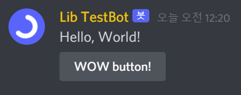

# Getting started

## Before getting started...

We suggest you be familiar with `py-cord` and `python`. This is a `py-cord-components` guide so it couldn't contain a lot of python explanations.

## Install the library

First, we need to install the library:

```
pip install --upgrade py-cord-components
```


If you meet an error `No matching distribution found for py-cord-components` when installing, try updating the python version! (It must be upper than `3.6`)


## Send buttons

Assuming you have invited your bot to some server, let's code. Create any python file and copy & paste the code below. (with replacing `your token` with your bot's token and `your prefix` with your bot's prefix)

```
from py_cord_components import PycordComponents, ComponentsBot, Button

bot = ComponentsBot(command_prefix = "your prefix")
"""
or you can just override the methods yourself

bot = discord.ext.commands.Bot("!")
DiscordComponents(bot)
"""


@bot.event
async def on_ready():
    print(f"Logged in as {bot.user}!")


@bot.command()
async def button(ctx):
    await ctx.send(
        "Hello, World!",
        components = [
            Button(label = "WOW button!", custom_id = "button1")
        ],
    )


bot.run("your token")
```



You created a button! well done. Let's add a little clarification to the code.&#x20;

`ComponentsBot(...)` initializes the client. It changes the bot's methods. So you could create components by  just`await ctx.send(..., components = [...])`.

`Button(label = "WOW button!", custom_id = "button1")` this piece of code creates a button with the label "WOW button!" and sets the custom\_id to "button1".&#x20;

```
await ctx.send(
    "Hello, World!",
    components = [
        Button(label = "WOW button!", custom_id = "button1")
    ]
)
```

This code makes the bot send a message containing the button.

### Responding to the interaction

&#x20; But when you click that button, you will meet the error `This interaction failed`. That's because you haven't responded to the `interaction (button click)`.  Let's edit the code.

```
from py_cord_components import PycordComponents, ComponentsBot, Button

bot = ComponentsBot(command_prefix = "your prefix")
"""
or you can just override the methods yourself

bot = discord.ext.commands.Bot("!")
DiscordComponents(bot)
"""


@bot.event
async def on_ready():
    print(f"Logged in as {bot.user}!")


@bot.command()
async def button(ctx):
    await ctx.send(
        "Hello, World!",
        components = [
            Button(label = "WOW button!", custom_id = "button1")
        ]
    )

    interaction = await bot.wait_for("button_click", check = lambda i: i.custom_id == "button1")
    await interaction.send(content = "Button clicked!")


bot.run("your token")
```

.png>)

We just added two lines and poof! An ephemeral message (a message which only can be seen by you).&#x20;

```
await bot.wait_for("button_click", check = lambda i: i.custom_id == "button1")
```

This method is the same as [`<discord.ext.commands.Bot>.wait_for`](https://discordpy.readthedocs.io/en/stable/ext/commands/api.html?highlight=wait\_for#discord.ext.commands.Bot.wait\_for). Except for the fact it returns [`Interaction`](broken-reference). This code waits until a user clicks the button with "button1" as a custom id. WOW!

```
await interaction.send(content = "Button clicked!")
```

This response to the interaction. It sends an ephemeral message with the content "Button clicked!". You could just send a normal message by setting the ephemeral parameter `False`.

### Send selects

Let's import some things and add a command!

```
from py_cord_components import PycordComponents, ComponentsBot, Button, Select, SelectOption

bot = ComponentsBot(command_prefix = "your prefix")
"""
or you can just override the methods yourself

bot = discord.ext.commands.Bot("!")
DiscordComponents(bot)
"""


@bot.event
async def on_ready():
    print(f"Logged in as {bot.user}!")


@bot.command()
async def button(ctx):
    await ctx.send(
        "Hello, World!",
        components = [
            Button(label = "WOW button!")
        ]
    )

    interaction = await bot.wait_for("button_click", check = lambda i: i.component.label.startswith("WOW"))
    await interaction.send(content = "Button clicked!")


@bot.command()
async def select(ctx):
    await ctx.send(
        "Hello, World!",
        components = [
            Select(
                placeholder = "Select something!",
                options = [
                    SelectOption(label = "A", value = "A"),
                    SelectOption(label = "B", value = "B")
                ]
            )
        ]
    )

    interaction = await bot.wait_for("select_option")
    await interaction.send(content = f"{interaction.values[0]} selected!")


bot.run("your token")
```

If you run this and type `!select`, you'll see a message with select! And if you select something, the bot will send an ephemeral message!

.png>)

he code is easy to understand. You send a select with two options - one with label A and value a (the value that is passed when selected, it is like custom id on buttons) and one with label B and value b. And the select's place holder is set to `Select something!`.

And you wait for the user to select an option. the `wait_for` returns an [`Interaction`](broken-reference) object. But the `component` property is the list of options the user selected (If you didn't set the `max_values` parameter when creating a select object, it contains 1 option).

You send an ephemeral message to the user telling the option the user selected.

### Now code!

You learned how to create a button and responding to an interaction..! Have an error or a question?&#x20;

Look at the [Frequently Asked questions](broken-reference) or go to the [discord server](https://discord.gg/294KSUxcz2) and ask a question!
